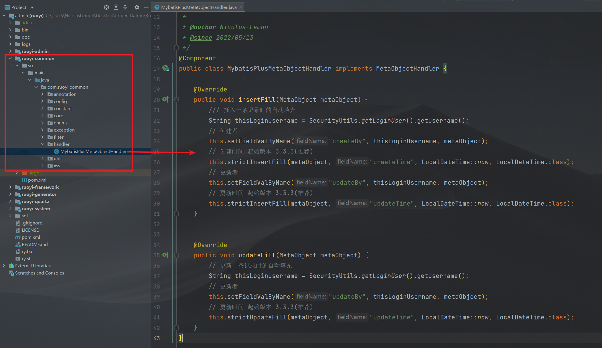
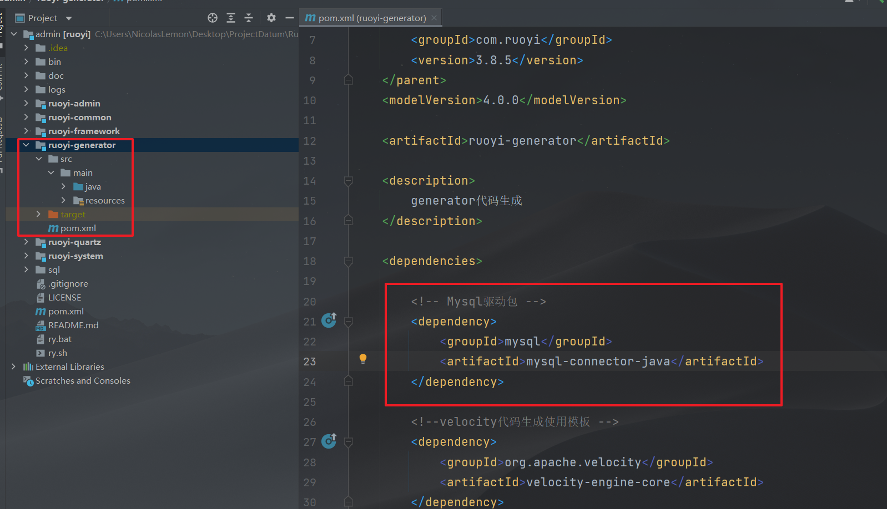
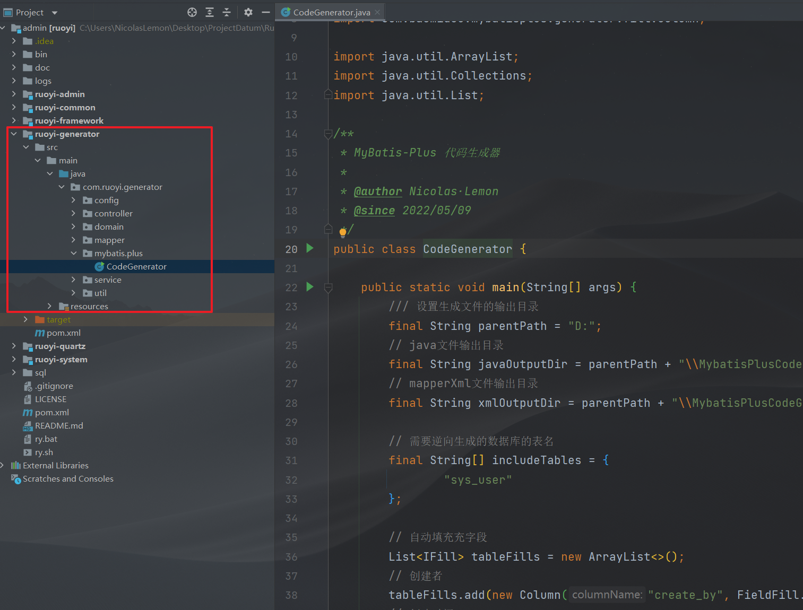
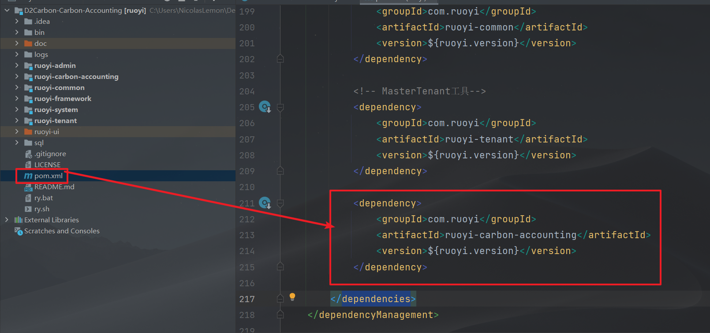
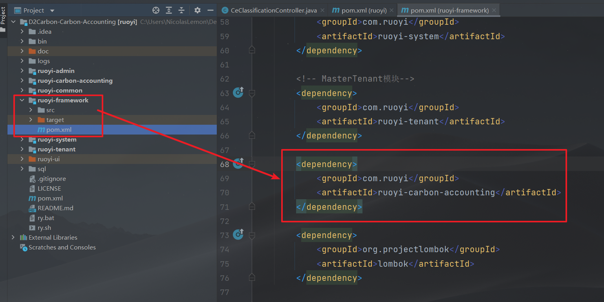
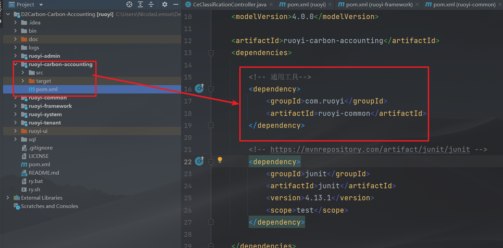

**在RuoYi-Vue v3.8.5 官方基础版上，整合Mybatis-Plus 3.5.1，含代码生成器以及自动填充**

# 项目结构

```context
com.ruoyi     
├── common            // 工具类
│       └── annotation                    // 自定义注解
│       └── config                        // 全局配置
│       └── constant                      // 通用常量
│       └── core                          // 核心控制
│       └── enums                         // 通用枚举
│       └── exception                     // 通用异常
│       └── filter                        // 过滤器处理
│       └── utils                         // 通用类处理
├── framework         // 框架核心
│       └── aspectj                       // 注解实现
│       └── config                        // 系统配置
│       └── datasource                    // 数据权限
│       └── interceptor                   // 拦截器
│       └── manager                       // 异步处理
│       └── security                      // 权限控制
│       └── web                           // 前端控制
├── ruoyi-generator   // 代码生成（可移除）
├── ruoyi-quartz      // 定时任务（可移除）
├── ruoyi-system      // 系统代码
├── ruoyi-admin       // 后台服务
├── ruoyi-xxxxxx      // 其他模块
```

# 整合笔记

## 引入依赖

1. 在总工程`pom.xml`文件中加入依赖版本号
   
   
   
   ```xml
   <lombok.version>1.18.20</lombok.version>
   <mybatis-plus.version>3.5.1</mybatis-plus.version>
   ```

2. 在`ruoyi-common`工程`pom.xml`文件中引入相关依赖
   
   **注：** 在总工程中引入该依赖不起作用
   
   
   
   ```xml
   <!-- SpringBoot集成MyBatis-Plus框架 -->
   <dependency>
       <groupId>com.baomidou</groupId>
       <artifactId>mybatis-plus-boot-starter</artifactId>
       <version>${mybatis-plus.version}</version>
   </dependency>
   
   <!-- mybatis-plus 代码生成-->
   <dependency>
       <groupId>com.baomidou</groupId>
       <artifactId>mybatis-plus-generator</artifactId>
       <version>${mybatis-plus.version}</version>
   </dependency>
   
   <!-- Lombok -->
   <dependency>
       <groupId>org.projectlombok</groupId>
       <artifactId>lombok</artifactId>
       <version>${lombok.version}</version>
   </dependency>
   ```

## 配置文件

1. 在`ruoyi-admin`工程`application.yml`文件中配置MyBatis-Plus以及整合RuoYi的MyBatis配置
   
   并注释掉原有的MyBatis配置
   
   
   
   
   
   ```yml
   # MyBatis-Plus 配置，已整合Mybatis配置
   mybatis-plus:
    global-config:
      # 数据库相关配置
      db-config:
        # 主键类型  AUTO:"数据库ID自增", INPUT:"用户输入ID", ID_WORKER:"全局唯一ID (数字类型唯一ID)", UUID:"全局唯一ID UUID";
        id-type: auto
        # 逻辑已删除值(默认为 1)
        logic-delete-value: 2
        # 逻辑未删除值(默认为 0)
        logic-not-delete-value: 0
      banner: false
    # 搜索指定包别名
    type-aliases-package: com.ruoyi.**.domain
    # 配置mapper的扫描，找到所有的mapper.xml映射文件
    mapper-locations: classpath*:mapper/**/*Mapper.xml
    configuration:
      # 指定 MyBatis 所用日志的具体实现
      log-impl: org.apache.ibatis.logging.slf4j.Slf4jImpl
      # log-impl: org.apache.ibatis.logging.stdout.StdOutImpl
      # 使用驼峰命名法转换字段
      map-underscore-to-camel-case: true
      # 使全局的映射器启用或禁用缓存
      cache-enabled: true
      # 允许JDBC 支持自动生成主键
      use-generated-keys: true
    # 配置默认的执行器.SIMPLE就是普通执行器;REUSE执行器会重用预处理语句(prepared statements);BATCH执行器将重用语句并执行批量更新
    executor-type: simple
   ```

2. 使RuoYi工程的`MyBatis`配置失效
   
   注释掉`ruoyi-framework`工程中的`MyBatisConfig`中的注解，使其Spring配置失效
   
   

至此，整合基本成功，可以运行项目试试


## 自动填充

1. 利用MyBatis-Plus的自动填充功能自动填充如`创建者、创建时间、更新者、更新时间`等字段
   
   
   
   `MybatisPlusMetaObjectHandler.java`
   
   ```java
   package com.ruoyi.common.handler;
   
   import com.baomidou.mybatisplus.core.handlers.MetaObjectHandler;
   import com.ruoyi.common.utils.SecurityUtils;
   import org.apache.ibatis.reflection.MetaObject;
   import org.springframework.stereotype.Component;
   
   import java.time.LocalDateTime;
   
   /**
    * MyBatis-Plus 自动填充字段 处理器
    *
    * @author Nicolas·Lemon
    * @since 2022/05/13
    */
   @Component
   public class MybatisPlusMetaObjectHandler implements MetaObjectHandler {
   
       @Override
       public void insertFill(MetaObject metaObject) {
           /// 插入一条记录时的自动填充
           String thisLoginUsername = SecurityUtils.getLoginUser().getUsername();
           // 创建者
           this.setFieldValByName("createBy", thisLoginUsername, metaObject);
           // 创建时间 起始版本 3.3.3(推荐)
           this.strictInsertFill(metaObject, "createTime", LocalDateTime::now, LocalDateTime.class);
           // 更新者
           this.setFieldValByName("updateBy", thisLoginUsername, metaObject);
           // 更新时间 起始版本 3.3.3(推荐)
           this.strictInsertFill(metaObject, "updateTime", LocalDateTime::now, LocalDateTime.class);
       }
   ```

2. 修改`BaseEntity.java`
   
   
   
   ```java
   package com.ruoyi.common.core.domain;
   
   import java.io.Serializable;
   import java.time.LocalDateTime;
   import java.util.Date;
   import java.util.HashMap;
   import java.util.Map;
   
   import com.baomidou.mybatisplus.annotation.FieldFill;
   import com.baomidou.mybatisplus.annotation.TableField;
   import com.fasterxml.jackson.annotation.JsonFormat;
   import com.fasterxml.jackson.annotation.JsonIgnore;
   import com.fasterxml.jackson.annotation.JsonInclude;
   import lombok.Getter;
   import lombok.Setter;
   
   /**
    * Entity基类
    *
    * @author ruoyi，Nicolas·Lemon
    */
   public class BaseEntity implements Serializable {
       private static final long serialVersionUID = 1L;
   
       /**
        * 搜索值
        */
       @JsonIgnore
       @TableField(exist = false)
       private String searchValue;
   
       /**
        * 创建者
        */
       @TableField(fill = FieldFill.INSERT)
       private String createBy;
   
       /**
        * 创建时间
        */
       @Getter
       @Setter
       @JsonFormat(pattern = "yyyy-MM-dd HH:mm:ss")
       @TableField(fill = FieldFill.INSERT)
       private LocalDateTime createTime;
   
       /**
        * 更新者
        */
       @TableField(fill = FieldFill.INSERT_UPDATE)
       private String updateBy;
   
       /**
        * 更新时间
        */
       @Getter
       @Setter
       @JsonFormat(pattern = "yyyy-MM-dd HH:mm:ss")
       @TableField(fill = FieldFill.INSERT_UPDATE)
       private LocalDateTime updateTime;
   
       /**
        * 备注
        */
       @TableField(exist = false)
       private String remark;
   
       /**
        * 请求参数
        */
       @JsonInclude(JsonInclude.Include.NON_EMPTY)
       @TableField(exist = false)
       private Map<String, Object> params;
   
       public String getSearchValue() {
           return searchValue;
       }
   
       public void setSearchValue(String searchValue) {
           this.searchValue = searchValue;
       }
   
       public String getCreateBy() {
           return createBy;
       }
   
       public void setCreateBy(String createBy) {
           this.createBy = createBy;
       }
   
       public String getUpdateBy() {
           return updateBy;
       }
   
       public void setUpdateBy(String updateBy) {
           this.updateBy = updateBy;
       }
   
       public String getRemark() {
           return remark;
       }
   
       public void setRemark(String remark) {
           this.remark = remark;
       }
   
       public Map<String, Object> getParams() {
           if (params == null) {
               params = new HashMap<>();
           }
           return params;
       }
   
       public void setParams(Map<String, Object> params) {
           this.params = params;
       }
   }
   ```

## 代码生成

在`ruoyi-generator`工程中配置

1. 引入MySQL驱动依赖
   
   `pom.xml`
   
   
   
   ```xml
   <!-- Mysql驱动包 -->
   <dependency>
       <groupId>mysql</groupId>
       <artifactId>mysql-connector-java</artifactId>
   </dependency>
   ```

2. 代码生成器
   
   
   
   `CodeGenerator.java`
   
   ```java
   package com.ruoyi.generator.mybatis.plus;
   
   import com.baomidou.mybatisplus.annotation.FieldFill;
   import com.baomidou.mybatisplus.generator.FastAutoGenerator;
   import com.baomidou.mybatisplus.generator.IFill;
   import com.baomidou.mybatisplus.generator.config.OutputFile;
   import com.baomidou.mybatisplus.generator.engine.VelocityTemplateEngine;
   import com.baomidou.mybatisplus.generator.fill.Column;
   
   import java.util.ArrayList;
   import java.util.Collections;
   import java.util.List;
   
   /**
    * MyBatis-Plus 代码生成器
    *
    * @author Nicolas·Lemon
    * @since 2022/05/09
    */
   public class CodeGenerator {
   
       public static void main(String[] args) {
           /// 设置生成文件的输出目录
           final String parentPath = "D:";
           // java文件输出目录
           final String javaOutputDir = parentPath + "\\MybatisPlusCodeGenerator\\java";
           // mapperXml文件输出目录
           final String xmlOutputDir = parentPath + "\\MybatisPlusCodeGenerator\\resources\\mapper";
   
           // 需要逆向生成的数据库的表名
           final String[] includeTables = {
                   "sys_user"
           };
   
           // 自动填充充字段
           List<IFill> tableFills = new ArrayList<>();
           // 创建者
           tableFills.add(new Column("create_by", FieldFill.INSERT));
           // 创建时间
           tableFills.add(new Column("create_time", FieldFill.INSERT));
           // 更新者
           tableFills.add(new Column("update_by", FieldFill.INSERT_UPDATE));
           // 更新时间
           tableFills.add(new Column("update_time", FieldFill.INSERT_UPDATE));
   
           // 快速生成模板
           FastAutoGenerator.create("jdbc:mysql://localhost:3306/ry_vue?useUnicode=true&characterEncoding=utf8&zeroDateTimeBehavior=convertToNull&useSSL=true&serverTimezone=GMT%2B8"
                           , "root", "root")
                   // 全局配置
                   .globalConfig(builder -> {
                       // 设置作者
                       builder.author("Nicolas·Lemon")
                               // 注释日期
                               .commentDate("yyyy/MM/dd")
                               // 开启 swagger 模式
                               .enableSwagger()
                               // 指定输出目录
                               .outputDir(javaOutputDir)
                               /// 覆盖已有文件
                               // .fileOverride()
                               // 禁止打开输出目录
                               .disableOpenDir();
                   })
                   // 包配置
                   .packageConfig(builder -> {
                       // 设置父包名
                       builder.parent("com.lemon")
                               /// 设置父包模块名
                               .moduleName("aaa")
                               // 指定实体包名
                               .entity("domain")
                               // 设置mapperXml生成路径
                               .pathInfo(Collections.singletonMap(OutputFile.mapperXml, xmlOutputDir));
                   })
                   // 策略配置
                   .strategyConfig(builder -> {
                       // 设置需要生成的表名（包含）
                       builder.addInclude(includeTables)
                               // 设置过滤表前缀
                               .addTablePrefix("t_", "c_")
                               // Controller策略配置
                               .controllerBuilder()
                               // 开启生成@RestController控制器
                               .enableRestStyle()
                               // Entity策略配置
                               .entityBuilder()
                               // 开启链式模型
                               .enableChainModel()
                               /*
                                   // 设置父类
                                   .superClass(BaseEntity.class)
                                   // 禁用生成 serialVersionUID
                                    .disableSerialVersionUID()
                                   // 添加父类公共字段
                                   .addSuperEntityColumns("create_by", "create_time", "update_by", "update_time")
                                */
                               // 开启 lombok 模型
                               .enableLombok()
                               // 表字段填充
                               .addTableFills(tableFills)
                               // 逻辑删除字段名(数据库)
                               .logicDeleteColumnName("del_flag")
                               // 逻辑删除属性名(实体)
                               .logicDeletePropertyName("delFlag")
                               // Service策略配置
                               .serviceBuilder()
                               // 去掉Service的I前缀
                               .formatServiceFileName("%sService")
                               // Mapper策略配置
                               .mapperBuilder()
                               // 开启 @Mapper 注解
                               .enableMapperAnnotation()
                               // 开启通用查询映射结果
                               .enableBaseResultMap()
                               // 开启通用查询结果列
                               .enableBaseColumnList();
   
                   })
                   // 使用Velocity引擎模板
                   .templateEngine(new VelocityTemplateEngine())
                   // 执行配置
                   .execute();
   
       }
   }
   ```
   
   测试代码生成器
   
   
   
   

# 新建maven工程

假设新建一个`ruoyi-xxx`自定义的maven工程，需要在以下几个地方加入自己添加的依赖，不然Spring Boot接管不到

1. **总**工程的`pom.xml`中引入自定义依赖
   
   

2. **ruoyi-framework**工程的`pom.xml`里引入自定义依赖
   
   

3. **自定义**工程的`pom.xml`中引入`ruoyi-common`模块
   
   ```xml
   <!-- 通用工具-->
   <dependency>
       <groupId>com.ruoyi</groupId>
       <artifactId>ruoyi-common</artifactId>
   </dependency>
   ```
   
   
