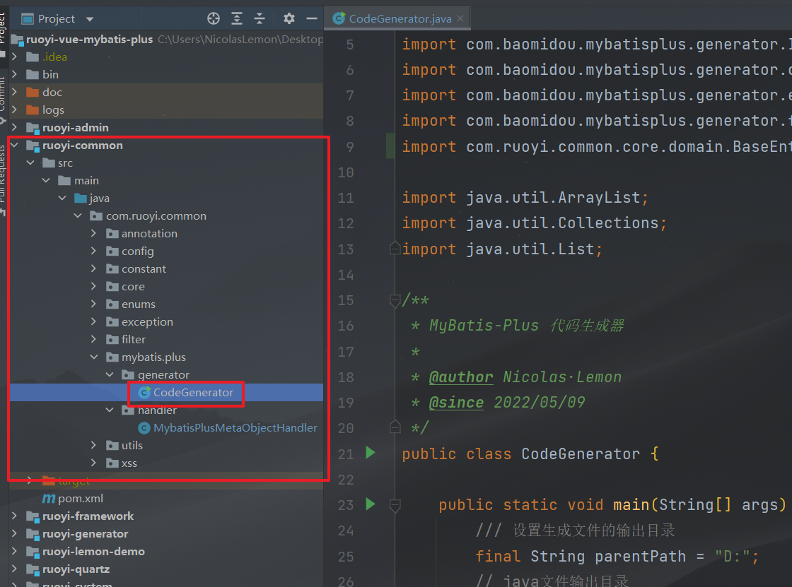

**在RuoYi-Vue v3.8.5 官方基础版上，整合Mybatis-Plus 3.5.1，含代码生成器以及自动填充**

# 项目结构

```context
com.ruoyi     
├── common            // 工具类
│       └── annotation                    // 自定义注解
│       └── config                        // 全局配置
│       └── constant                      // 通用常量
│       └── core                          // 核心控制
│       └── enums                         // 通用枚举
│       └── exception                     // 通用异常
│       └── filter                        // 过滤器处理
│       └── mybatis.plus                  // MyBatis-Plus相关
│       └── utils                         // 通用类处理
├── framework         // 框架核心
│       └── aspectj                       // 注解实现
│       └── config                        // 系统配置
│       └── datasource                    // 数据权限
│       └── interceptor                   // 拦截器
│       └── manager                       // 异步处理
│       └── security                      // 权限控制
│       └── web                           // 前端控制
├── ruoyi-generator   // 代码生成（可移除）
├── ruoyi-quartz      // 定时任务（可移除）
├── ruoyi-system      // 系统代码
├── ruoyi-admin       // 后台服务
├── ruoyi-xxxxxx      // 其他模块（自定义）
```

# 整合篇

## 引入依赖

1. 在总工程`pom.xml`文件中加入依赖版本号
   
   
   
   ```xml
   <lombok.version>1.18.20</lombok.version>
   <mybatis-plus.version>3.5.1</mybatis-plus.version>
   ```

2. 在`ruoyi-common`工程`pom.xml`文件中引入相关依赖
   
   **注：** 在总工程中引入该依赖不起作用
   
   
   
   ```xml
   <!-- SpringBoot集成MyBatis-Plus框架 -->
   <dependency>
       <groupId>com.baomidou</groupId>
       <artifactId>mybatis-plus-boot-starter</artifactId>
       <version>${mybatis-plus.version}</version>
   </dependency>
   
   <!-- mybatis-plus 代码生成-->
   <dependency>
       <groupId>com.baomidou</groupId>
       <artifactId>mybatis-plus-generator</artifactId>
       <version>${mybatis-plus.version}</version>
   </dependency>
   
   <!-- Lombok -->
   <dependency>
       <groupId>org.projectlombok</groupId>
       <artifactId>lombok</artifactId>
       <version>${lombok.version}</version>
   </dependency>
   ```

## 配置文件

1. 在`ruoyi-admin`工程`application.yml`文件中配置MyBatis-Plus以及整合RuoYi的MyBatis配置
   
   并注释掉原有的MyBatis配置
   
   
   
   
   
   ```yml
   # MyBatis-Plus 配置，已整合Mybatis配置
   mybatis-plus:
    global-config:
      # 数据库相关配置
      db-config:
        # 主键类型  AUTO:"数据库ID自增", INPUT:"用户输入ID", ID_WORKER:"全局唯一ID (数字类型唯一ID)", UUID:"全局唯一ID UUID";
        id-type: auto
        # 逻辑已删除值(默认为 1)
        logic-delete-value: 2
        # 逻辑未删除值(默认为 0)
        logic-not-delete-value: 0
      banner: false
    # 搜索指定包别名
    type-aliases-package: com.ruoyi.**.domain
    # 配置mapper的扫描，找到所有的mapper.xml映射文件
    mapper-locations: classpath*:mapper/**/*Mapper.xml
    configuration:
      # 指定 MyBatis 所用日志的具体实现
      log-impl: org.apache.ibatis.logging.slf4j.Slf4jImpl
      # log-impl: org.apache.ibatis.logging.stdout.StdOutImpl
      # 使用驼峰命名法转换字段
      map-underscore-to-camel-case: true
      # 使全局的映射器启用或禁用缓存
      cache-enabled: true
      # 允许JDBC 支持自动生成主键
      use-generated-keys: true
    # 配置默认的执行器.SIMPLE就是普通执行器;REUSE执行器会重用预处理语句(prepared statements);BATCH执行器将重用语句并执行批量更新
    executor-type: simple
   ```

2. 使RuoYi工程的`MyBatis`配置失效
   
   注释掉`ruoyi-framework`工程中的`MyBatisConfig`中的注解，使其Spring配置失效
   
   

至此，整合基本成功，可以运行项目试试


## 自动填充

在`ruoyi-common`工程中：

1. 利用MyBatis-Plus的自动填充功能自动填充如`创建者、创建时间、更新者、更新时间`等字段
   
   
   
   `MybatisPlusMetaObjectHandler.java`
   
   ```java
   package com.ruoyi.common.mybatis.plus.handler;
   
   import com.baomidou.mybatisplus.core.handlers.MetaObjectHandler;
   import com.ruoyi.common.utils.SecurityUtils;
   import lombok.extern.slf4j.Slf4j;
   import org.apache.ibatis.reflection.MetaObject;
   import org.springframework.stereotype.Component;
   
   import java.time.LocalDateTime;
   
   /**
    * MyBatis-Plus 自动填充字段 处理器
    *
    * @author Nicolas·Lemon
    * @since 2022/05/13
    */
   @Slf4j
   @Component
   public class MybatisPlusMetaObjectHandler implements MetaObjectHandler {
   
       @Override
       public void insertFill(MetaObject metaObject) {
           /// 插入一条记录时的自动填充
           log.info("start insert fill ....");
           String thisLoginUsername = SecurityUtils.getLoginUser().getUsername();
           // 创建者
           this.setFieldValByName("createBy", thisLoginUsername, metaObject);
           // 创建时间 起始版本 3.3.3(推荐)
           this.strictInsertFill(metaObject, "createTime", LocalDateTime::now, LocalDateTime.class);
           // 更新者
           this.setFieldValByName("updateBy", thisLoginUsername, metaObject);
           // 更新时间 起始版本 3.3.3(推荐)
           this.strictInsertFill(metaObject, "updateTime", LocalDateTime::now, LocalDateTime.class);
       }
   
      @Override
      public void updateFill(MetaObject metaObject) {
          // 更新一条记录时的自动填充
          log.info("start update fill ....");
          String thisLoginUsername = SecurityUtils.getLoginUser().getUsername();
          // 更新者
          this.setFieldValByName("updateBy", thisLoginUsername, metaObject);
          // 更新时间 起始版本 3.3.3(推荐)
          this.strictUpdateFill(metaObject, "updateTime", LocalDateTime::now, LocalDateTime.class);
      }
   ```

2. 修改`BaseEntity.java`


`BaseEntity.java`

```java
package com.ruoyi.common.core.domain;

import java.io.Serializable;
import java.time.LocalDateTime;
import java.util.HashMap;
import java.util.Map;

import com.baomidou.mybatisplus.annotation.FieldFill;
import com.baomidou.mybatisplus.annotation.TableField;
import com.fasterxml.jackson.annotation.JsonFormat;
import com.fasterxml.jackson.annotation.JsonIgnore;
import com.fasterxml.jackson.annotation.JsonInclude;
import lombok.Getter;
import lombok.Setter;

/**
 * Entity基类
 *
 * @author ruoyi，Nicolas·Lemon
 */
public class BaseEntity implements Serializable {
    private static final long serialVersionUID = 1L;

    /**
     * 搜索值
     */
    @JsonIgnore
    @TableField(exist = false)
    private String searchValue;

    /**
     * 创建者
     */
    @TableField(fill = FieldFill.INSERT)
    private String createBy;

    /**
     * 创建时间
     */
    @Getter
    @Setter
    @JsonFormat(pattern = "yyyy-MM-dd HH:mm:ss")
    @TableField(fill = FieldFill.INSERT)
    private LocalDateTime createTime;

    /**
     * 更新者
     */
    @TableField(fill = FieldFill.INSERT_UPDATE)
    private String updateBy;

    /**
     * 更新时间
     */
    @Getter
    @Setter
    @JsonFormat(pattern = "yyyy-MM-dd HH:mm:ss")
    @TableField(fill = FieldFill.INSERT_UPDATE)
    private LocalDateTime updateTime;

    /**
     * 备注
     */
    @TableField(exist = false)
    private String remark;

    /**
     * 请求参数
     */
    @JsonInclude(JsonInclude.Include.NON_EMPTY)
    @TableField(exist = false)
    private Map<String, Object> params;

    public String getSearchValue() {
        return searchValue;
    }

    public void setSearchValue(String searchValue) {
        this.searchValue = searchValue;
    }

    public String getCreateBy() {
        return createBy;
    }

    public void setCreateBy(String createBy) {
        this.createBy = createBy;
    }

    public String getUpdateBy() {
        return updateBy;
    }

    public void setUpdateBy(String updateBy) {
        this.updateBy = updateBy;
    }

    public String getRemark() {
        return remark;
    }

    public void setRemark(String remark) {
        this.remark = remark;
    }

    public Map<String, Object> getParams() {
        if (params == null) {
            params = new HashMap<>();
        }
        return params;
    }

    public void setParams(Map<String, Object> params) {
        this.params = params;
    }
}
```

## 代码生成

在`ruoyi-common`工程中配置

1. pom文件中添加MySQL驱动包依赖
   
   ```xml
   <!-- MySQL驱动包 -->
   <dependency>
       <groupId>mysql</groupId>
       <artifactId>mysql-connector-java</artifactId>
   </dependency>
   ```



 `CodeGenerator.java`

```java
package com.ruoyi.common.mybatis.plus.generator;

import com.baomidou.mybatisplus.annotation.FieldFill;
import com.baomidou.mybatisplus.generator.FastAutoGenerator;
import com.baomidou.mybatisplus.generator.IFill;
import com.baomidou.mybatisplus.generator.config.OutputFile;
import com.baomidou.mybatisplus.generator.engine.VelocityTemplateEngine;
import com.baomidou.mybatisplus.generator.fill.Column;
import com.ruoyi.common.core.domain.BaseEntity;

import java.util.ArrayList;
import java.util.Collections;
import java.util.List;

/**
 * MyBatis-Plus 代码生成器
 *
 * @author Nicolas·Lemon
 * @since 2022/05/09
 */
public class CodeGenerator {

    public static void main(String[] args) {
        /// 设置生成文件的输出目录
        final String parentPath = "D:";
        // java文件输出目录
        final String javaOutputDir = parentPath + "\\MybatisPlusCodeGenerator\\java";
        // mapperXml文件输出目录
        final String xmlOutputDir = parentPath + "\\MybatisPlusCodeGenerator\\resources\\mapper";

        // 需要逆向生成的数据库的表名
        final String[] includeTables = {
                "diy_demo_user"
        };

        // 自动填充充字段
        List<IFill> tableFills = new ArrayList<>();
        // 创建者
        tableFills.add(new Column("create_by", FieldFill.INSERT));
        // 创建时间
        tableFills.add(new Column("create_time", FieldFill.INSERT));
        // 更新者
        tableFills.add(new Column("update_by", FieldFill.INSERT_UPDATE));
        // 更新时间
        tableFills.add(new Column("update_time", FieldFill.INSERT_UPDATE));

        // 快速生成模板
        FastAutoGenerator.create("jdbc:mysql://localhost:3306/ry_vue?useUnicode=true&characterEncoding=utf8&zeroDateTimeBehavior=convertToNull&useSSL=true&serverTimezone=GMT%2B8"
                        , "root", "root")
                // 全局配置
                .globalConfig(builder -> {
                    // 设置作者
                    builder.author("Nicolas·Lemon")
                            // 注释日期
                            .commentDate("yyyy/MM/dd")
                            /// 开启 swagger 模式
                            // .enableSwagger()
                            // 指定输出目录
                            .outputDir(javaOutputDir)
                            // 覆盖已有文件
                            .fileOverride()
                            // 禁止打开输出目录
                            .disableOpenDir();
                })
                // 包配置
                .packageConfig(builder -> {
                    // 设置父包名
                    builder.parent("com.lemon")
                            /// 设置父包模块名
                            .moduleName("demo")
                            // 指定实体包名
                            .entity("domain")
                            // 设置mapperXml生成路径
                            .pathInfo(Collections.singletonMap(OutputFile.mapperXml, xmlOutputDir));
                })
                // 策略配置
                .strategyConfig(builder -> {
                    // 设置需要生成的表名（包含）
                    builder.addInclude(includeTables)
                            // 设置过滤表前缀
                            .addTablePrefix("t_", "c_")
                            // Controller策略配置
                            .controllerBuilder()
                            // 开启生成@RestController控制器
                            .enableRestStyle()
                            // Entity策略配置
                            .entityBuilder()
                            // 开启链式模型
                            .enableChainModel()
                            // 禁用生成 serialVersionUID
                            .disableSerialVersionUID()
                            // 设置父类
                            .superClass(BaseEntity.class)
                            // 添加父类公共字段
                            .addSuperEntityColumns("create_by", "create_time", "update_by", "update_time", "remark")
                            // 开启 lombok 模型
                            .enableLombok()
                            // 表字段填充
                            .addTableFills(tableFills)
                            // 逻辑删除字段名(数据库)
                            .logicDeleteColumnName("del_flag")
                            // 逻辑删除属性名(实体)
                            .logicDeletePropertyName("delFlag")
                            // Service策略配置
                            .serviceBuilder()
                            // 去掉Service的I前缀
                            .formatServiceFileName("%sService")
                            // Mapper策略配置
                            .mapperBuilder()
                            // 开启 @Mapper 注解
                            .enableMapperAnnotation()
                            // 开启通用查询映射结果
                            .enableBaseResultMap()
                            // 开启通用查询结果列
                            .enableBaseColumnList();

                })
                // 使用Velocity引擎模板
                .templateEngine(new VelocityTemplateEngine())
                // 执行配置
                .execute();

    }
}
```

   测试代码生成器


# 工程篇

## 注意

若依工程自带token鉴权，如果不登录前端，只用后端测试的话，需要在`ruoyi-framework`工程里的`SecurityConfig`中放行请求接口，不然接口会被拦截的；或者利用SpringBootTest+JUnit来进行测试


注意：利用测试类的话，需要如下配置，不然就会报错的：


```java
@RunWith(SpringRunner.class)
@SpringBootTest(classes = RuoYiApplication.class)
@ComponentScan(basePackages = {"com.ruoyi", "com.lemon"})
```

`pom.xml`

```xml
<!-- junit4单元测试 -->
    <dependency>
        <groupId>junit</groupId>
        <artifactId>junit</artifactId>
        <version>4.13.1</version>
        <scope>test</scope>
    </dependency>

<!-- Spring Boot 测试 -->
    <dependency>
        <groupId>org.springframework.boot</groupId>
        <artifactId>spring-boot-starter-test</artifactId>
    </dependency>

<!-- 添加Spring Boot测试的若依启动类 -->
    <dependency>
        <groupId>com.ruoyi</groupId>
        <artifactId>ruoyi-admin</artifactId>
        <version>${ruoyi.version}</version>
        <scope>test</scope>
    </dependency>
```

## 新建maven工程

假设新建一个`ruoyi-lemon-demo`的自定义maven工程，需要在以下几个地方加入自己添加的依赖，不然Spring Boot接管不到

1. **总**工程的`pom.xml`中引入自定义工程的依赖
   
   

2. **ruoyi-framework**工程的`pom.xml`里引入自定义工程的依赖
   
   

3. **自定义**工程的`pom.xml`中引入`ruoyi-common`模块
   
   
   
   ```xml
   <!-- 通用工具-->
   <dependency>
       <groupId>com.ruoyi</groupId>
       <artifactId>ruoyi-common</artifactId>
   </dependency>
   ```

## 自定义包名

框架工程中是`com.ruoyi`的包名，如果想用自定义包名`com.lemon`，则需要做出适当修改，不然工程无法扫描到包

1. `ruoyi-admin`工程的spring配置文件文件中，mybatis-plus配置中加入新的包
   
   
   
   ```yml
   # 搜索指定包别名
   type-aliases-package: com.ruoyi.**.domain,com.lemon.**.domain
   ```

2. `ruoyi-framework`工程中需要修改对应的`ApplicationConfig.java`工程配置类，添加自己新的包
   
   
   
   `ApplicationConfig.java`
   
   ```java
   package com.ruoyi.framework.config;
   
   import java.util.TimeZone;
   
   import org.mybatis.spring.annotation.MapperScan;
   import org.springframework.boot.autoconfigure.jackson.Jackson2ObjectMapperBuilderCustomizer;
   import org.springframework.context.annotation.Bean;
   import org.springframework.context.annotation.ComponentScan;
   import org.springframework.context.annotation.Configuration;
   import org.springframework.context.annotation.EnableAspectJAutoProxy;
   
   /**
    * 程序注解配置
    *
    * @author ruoyi
    */
   @Configuration
   // 表示通过aop框架暴露该代理对象,AopContext能够访问
   @EnableAspectJAutoProxy(exposeProxy = true)
   // 指定要扫描的Mapper类的包的路径
   @MapperScan({"com.ruoyi.**.mapper", "com.lemon.**.mapper"})
   // 指定要扫描的组件类的包的路径
   @ComponentScan({"com.lemon", "com.ruoyi"})
   public class ApplicationConfig {
       /**
        * 时区配置
        */
       @Bean
       public Jackson2ObjectMapperBuilderCustomizer jacksonObjectMapperCustomization() {
           return jacksonObjectMapperBuilder -> jacksonObjectMapperBuilder.timeZone(TimeZone.getDefault());
       }
   }
   ```

## MP联表查询

有两张表，一张`diy_user`用户表，一张`diy_user_area`用户区域表，这两张表通过`area_id`区域id外键连接，简化sql，用MyBatis-Plus，只查询用户表，就把用户区域表中的内容给一对一带出来。


上面用户区域实体中还包含一个`areaIntroduction` 区域简介 的字段，这里用不着，是下面AOP切面增强的内容，这里无需纠结

**注意：** 根据MP插件源码提供的信息，若在下面需要沿用其自带的`wrapper`，则需要在自定义sql的地方加上`${ew.customSqlSegment}`和`@Param("ew")`，

代码中已更正！

源码里的：


自己的代码：


1. 用户表实体中包含用户区域实体
   
   

2. 利用`@Results`注解映射两实体之间的关系，除了有`@One`，还有`@Many`，区分应用场景哈，这里用户与区域的关系是设定的一对一
   
   
   
   就可以了，是不是比纯用MyBatis简单

## AOP切面增强

还是上面那两张表，假设现在有个无聊的想法，在上述联合查询中，用户区域数据表中没有`区域简介`字段，但是我想对用户区域表中的内容做点增强处理，给查询到的结果自动加上对应的区域简介


1. 自定义一个aop织入点接口注解
   
   这里仅仅只当作aop切入点，所以我将接口放在`ruoyi-common`工程中的`annotation`文件夹中
   
   
   
   `MapperEnhancement.java`
   
   ```java
   package com.ruoyi.common.annotation;
   
   import java.lang.annotation.*;
   
   /**
    * Mapper增强注解
    * 只当切入点
    *
    * @author 尼古拉斯·柠檬
    * @since 2023/3/16
    */
   @Target(ElementType.METHOD)
   @Retention(RetentionPolicy.RUNTIME)
   @Documented
   public @interface MapperEnhancement {
   }
   ```

2. 自定义aop切面
   
   这里只展示结构，具体业务处理可以参考工程代码（在自定义工程中）
   
   
   
   `DiyDemoMapperAspect.java`
   
   ```java
   package com.lemon.demo.aspect;
   
   import lombok.extern.slf4j.Slf4j;
   import org.aspectj.lang.ProceedingJoinPoint;
   import org.aspectj.lang.annotation.Around;
   import org.aspectj.lang.annotation.Aspect;
   import org.aspectj.lang.annotation.Pointcut;
   import org.aspectj.lang.reflect.MethodSignature;
   import org.springframework.stereotype.Component;
   
   import java.lang.reflect.Method;
   import java.util.List;
   
   /**
    * AOP切面增强
    * 对自定义Demo中Mapper的查询结果做增强处理
    *
    * @author 尼古拉斯·柠檬
    * @since 2023/3/16
    */
   @Aspect
   @Component
   @Slf4j
   public class DiyDemoMapperAspect {
   
       /**
        * 切点：在Mapper方法上使用注解 @MapperEnhancement
        */
       @Pointcut("@annotation(com.ruoyi.common.annotation.MapperEnhancement)")
       public void mapperPointcut() {
       }
   
       /**
        * DiyUserMapper环绕增强
        * 双重条件锁定：
        * 1、在Mapper方法上使用@MapperEnhancement注解
        * 2、注解只有在DiyUserMapper中才切入此方法
        */
       @Around("mapperPointcut() && execution(* com.lemon.demo.mapper.DiyUserMapper.*(..))")
       public Object aroundDiyUserMapper(ProceedingJoinPoint joinPoint) throws Throwable {
           // 获取切入的方法名称
           MethodSignature signature = (MethodSignature) joinPoint.getSignature();
           Method signatureMethod = signature.getMethod();
           log.info("开启 " + signatureMethod + " 方法环绕型增强");
           // 下一步是正常处理，获取返回的结果
           Object result = joinPoint.proceed();
           // 判断结果是List集合还是Object对象
           if (result instanceof List) {
               // 增强用户区域实体对象，赋值区域简介
               for (Object object : (List) result) {
                   /** 这里做增强处理 */
               }
               return result;
           }
           // 增强用户区域实体对象，赋值区域简介
           /** 这里做增强处理 */
           return result;
       }
   }
   ```

3. 在所需要的Mapper中加入自定义的切入点注解
   
   这里是在上面联表查询的用户Mapper中切入的
   
   
   
   就可以自动进行切入了，以后就不用在业务调用中，再去手动处理了

## PDF表格动态合并

假设现在有一个需求：生成一个PDF文件，该PDF文件中包含一个5列n行的表格，表格第1列是`地区`，第2列是`爱好`、第3列是`姓名`、第4列是`性别`、第5列是`年龄`；每个地区有若干个人，假设每个人只有一个爱好，分区域统计相同爱好的人，并分别动态合并第1列和第2列中相同元素的单元格

**效果图：**


**实现：**

利用itext7去完成该项设计，具体可参照工程中的代码：`ruoyi-lemon-demo`工程中的`PdfGeneratorUtils.java`，其调用方法在测试类`PdfGeneratorTest.java`中，其中有用到上面的用户实体类和用户区域实体类，可留意相关注释说明。

注：在生成表格或者pdf的时候，不要使用奇奇怪怪的中文字符，避免程序无法正常生成pdf（会在document.close()这步中抛出空指针异常）。

```xml
<!-- 生成PDF所需核心依赖-->
<dependency>
    <groupId>com.itextpdf</groupId>
    <artifactId>itext7-core</artifactId>
    <version>7.2.5</version>
    <type>pom</type>
</dependency>
```


